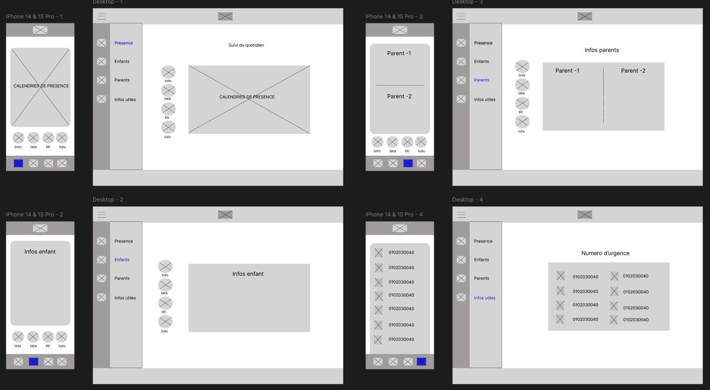
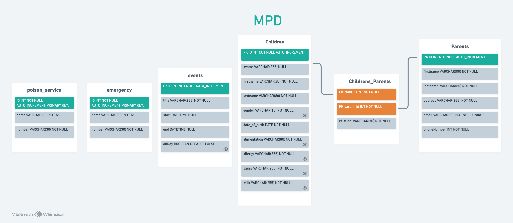

## 🚀 Bienvenue sur mon projet checkpoint 4 réalisé à la Wild Code School  

## 💥 Les compétences :

### 🌞 Développer la partie front-end d'une application web ou web mobile sécurisée :

- Maquetter des interfaces utilisateur web ou web mobile
- Réaliser des interfaces utilisateur statiques web ou web mobile
- Développer la partie dynamique des interfaces utilisateur web ou web mobile

### 📈 Développer la partie back-end d'une application web ou web mobile sécurisée :

- Mettre en place une base de données relationnelle
- Développer des composants d'accès aux données SQL et NoSQL
- Développer des composants métier coté serveur

## 💻 Aperçu de la version Desktop :

## 📱 Aperçu de la version mobile :

## 🛠️ Fonctionnalités :

### 👥 Partie Utilisateur :

- L'utilisateur peut créer, mettre à jour ou supprimer des événements sur le calendrier.
- L'utilisateur peut voir la liste des enfants avec les informations de chacun.
- L'utilisateur peut voir les informations des parents reliés aux enfants.
- L'utilisateur a accès à tous les numéros d'urgence.

### 📝 Dans cette version :

- Les pages sont fonctionnelles.
- Les informations proviennent de la base de données.
- Il est possible d'ajouter, mettre à jour ou supprimer des événements sur le calendrier.
- Le site est responsive.

### 🔜 A venir :

- Créer une authentification.
- Avoir la possibilité d'ajouter ou supprimer des enfants/parents/informations relatives à ceux-ci.
- Mise à jour du calendrier en version française avec possibilité de personnaliser les événements par couleur.

## 📈 Statut du projet

V1.0.0 Terminé
V2.0.0 En développement

## Technos utilisé

## 📊 Wireframe :

### 🖌️ Design du site sur Figma :

 

## 💻 Modélisation de la base de données :

## 🛠️ Setup & utilisation

### 📜 Commandes disponibles

- `npm i` : Initialisation du frontend et du backend, ainsi que de tous les outils
- `npm run db:migrate` : Exécute le script de migration de la base de données
- `npm run dev` : Démarre les deux serveurs (frontend + backend) dans un seul terminal
- `npm run dev:client` : Démarre le serveur frontend React
- `npm run dev:server` : Démarre le serveur backend Express
- `lint` : Exécute les outils de validation et refuse le code non conforme (sera exécuté à chaque _commit_)
- `fix` : Corrige les erreurs de linter (exécutez-le si `lint` grogne sur votre code !)

## 📄 Plus d'informations

- Le modèle utilisé pour ce projet est un modèle de fondation Fullstack réalisé par la Wild Code School.

- N'oubliez pas de créer vos fichiers .env pour le frontend et le backend en copiant les fichiers .env.sample de chaque répertoire.

### 🔧 Outils utilisé :

- _Concurrently_ : Permet de lancer plusieurs commandes simultanément dans la même interface de ligne de commande (CLI).
- _Husky_ : Permet d'exécuter des commandes spécifiques déclenchées par des événements git.
- _Vite_ : Alternative à Create-React-App, offrant moins d'outils pour une expérience plus fluide.
- _ESLint_ : Outil de "qualité du code", garantit que les règles choisies seront appliquées.
- _Prettier_ : Outil de "qualité du code" également, se concentre sur le guide de style.
- _Airbnb Standard_ : L'un des "standards" les plus connus, bien qu'il ne soit pas officiellement lié à ES/JS.
- _Nodemon_ : Permet de redémarrer le serveur à chaque mise à jour d'un fichier .js.

### 👥 Créateur :

[Nicolas GERIN](https://github.com/NicoGER1)
